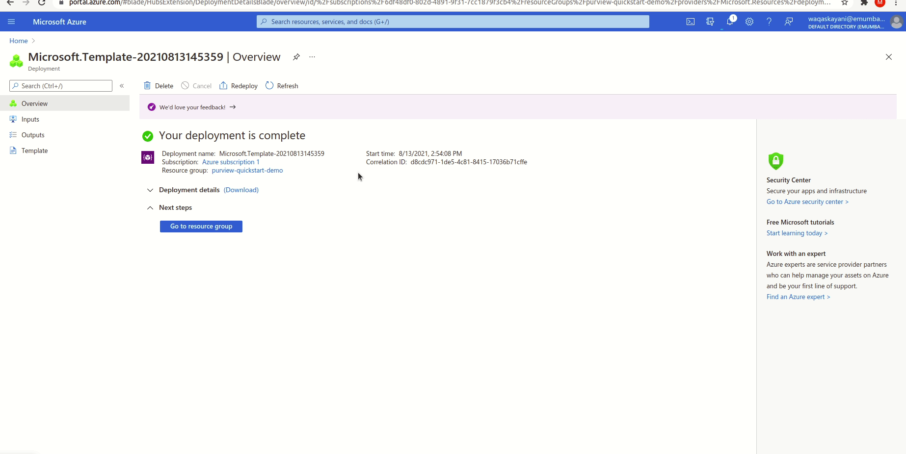

# purview-poc

  

Azure Purview accounts are managed and configured using Azure ARM templates and Azure Functions, using Azure Purview REST APIs.

## Table of Contents

* [APIs](#apis)
* [Prerequisites](#prerequisites)
* [Roles and Access Policies](#roles-and-access-policies)
* [Setup and Configure Purview](#setup-and-configure-purview)
* [Troubleshooting](#troubleshooting)

## APIs

Azure Purview account configurations are managed using its REST APIs through the use of two Azure Functions. One is used to create/configure data resources and the other to delete the provisioned resources.

The following APIs are called in the creation/configuration function:

* [Create/Update Data Source](https://docs.microsoft.com/en-us/rest/api/purview/scanningdataplane/data-sources/create-or-update)
* [Create Scan](https://docs.microsoft.com/en-us/rest/api/purview/scanningdataplane/scans/create-or-update)
* [Run Scan](https://docs.microsoft.com/en-us/rest/api/purview/scanningdataplane/scan-result/run-scan)
* [Create Glossary Term](https://atlas.apache.org/api/v2/resource_GlossaryREST.html#resource_GlossaryREST_createGlossaryTerm_POST)

The following APIs are called in the deletion function:

* [Delete Data Source](https://docs.microsoft.com/en-us/rest/api/purview/scanningdataplane/data-sources/delete)
* [Delete Glossary Term](https://atlas.apache.org/api/v2/resource_GlossaryREST.html#resource_GlossaryREST_deleteGlossaryTerm_DELETE)

## Prerequisites

* Application registration needs to be created to enable authentication against your Azure Active Directory  

**To be provided:**

* The following values are needed when using the OneClick Deployment ARM template:-
    * **Resource Group:** Name of the resource group. All the resources created by the template will be in this resource group.
    * **Region:** Azure region in which to create the resource group.
    * **Data Lake Account Name:** Name of the ADSL2 storage account. This storage account will be created and registered as a data source with Purview account. The name you provide will be appended with a unique sting to make it globally available. The field can contain only lowercase letters and numbers. Name must be between 1 and 11 characters.
    * **Storage Account Name:** Name of the Blob storage account. This storage account will be created and registered as a data source with Purview account. The name you provide will be appended with a unique sting to make it globally available. The field can contain only lowercase letters and numbers. Name must be between 1 and 11 characters.
    * **New or existing Purview Account:** Whether to create a new Purview account or use an existing one.
    * **Purview Account Name:** Name of the Azure Purview Account. In case of new Purview account, give a new name. To use an existing one, enter the name of existing purview account. For the new Purview account, the name you provide will be appended with a unique sting to make it globally available. The Purview account name can contain only letters, numbers and hyphens. The first and last characters must be a letter or number. The hyphen(-) character must be immediately preceded and followed by a letter or number. Spaces are not allowed.
    * **Purview Resource Group:** Povide the name of the resource group for the existing Purview account. Leave as it is if you are creating a new Purview account or if the existing Purview account is present in the same resource group where all other resources are going to be deployed. This resource group is required to get the Purview account path to assign required RBAC role(s) to the new or existing Purview account.
    * **Key Vault Name:** Name of the Azure Key vault. This is used to store Client Secret needed to perform API calls and also information on resources such as data sources and glossary terms, so they can be purged afterwards when delete function is triggered. The name you provide will be appended with a unique sting to make it globally available. A vault's name must be between 1-11 alphanumeric characters. The name must begin with a letter, end with a letter or digit, and not contain consecutive hyphens.
    * **Factory Name:** Name for the Azure Data Factory. This Data Factory will be created and load the data into the storage accounts with sample NYC Taxi data. The name you provide will be appended with a unique sting to make it globally available. The name can contain only letters, numbers and hyphens. The first and last characters must be a letter or number. Spaces are not allowed.
    * **Aad App Client Id:** Client ID of the Application Registration created in prerequisite.
    * **Aad App Client Secret:** Client Secret of the Application Registration created in prerequisite.
    * **Location:** Location where the resources will be deployed. It is, by default, set to the region of the resource group. You can upadate it to any other region. Note that all the resources will be deployed to the same location/region, that is why while chhosing the loaction, make sure all the resources/services are available in that location/region.

Click the following button to deploy all the resources:-

## Roles and Access Policies

The following table illustrates the required roles and permissions needed:-

<table>
    <thead>
        <tr>
            <th>Feature/Service</th>
            <th>Role Assigned</th>
        </tr>
    </thead>
    <tbody>
        <tr>
            <td rowspan=2>Application Registration</td>
            <td>Purview Data Curator</td>
        </tr>
        <tr>
            <td>Purview Data Source Administrator</td>
        </tr>
    </tbody>
</table>

## Setup and Configure Purview

The following steps are required for a successful deployment of the QuickStart.

* Create an Application Registration in Azure Active Directory. Which helps in establishing a trust relationship between application and the Microsoft identity platform. Copy the client id and client secret from App registration as shown below:-

  

* To give application access to the subscription, in Azure Subscription console, add a role assignment of role `Purview Data Curator` and `Purview Data Source Administrator` to the Service Principal App registration created earlier as shown below:-

  

* Use the OneClick Deployment button above to start the deployment of resources. Currently it takes ~15 minutes for one complete deployment. After the deployment is complete, the resources can be deleted by running the delete function url in the deployment output as shown below:-

  

## Troubleshooting

This portion lists solutions to problems one might encounter with Purview OneClick Deployment.

### Common Problems

Here is a list of common problems one might encounter while deploying the template:-

* Deployment failed on `runDataFactory` step
* Deployment failed on `triggerConfigurePurviewFunction` step

For both of the problems listed above, somply deploying the ARM template again solves the problem. 

### Solution
In case the deployment failed on both above mentioned steps, this can be caused by the Powershell modules used in the deployment script.
Make sure that:

* The App Registration client ID and client secret are correct
* The application service principal has access to the `Purview Data Curator` and `Purview Data Source Administrator` roles at subscription level.

If the above requirements are satisfied, rerunning the deployment should resolve this issue.
