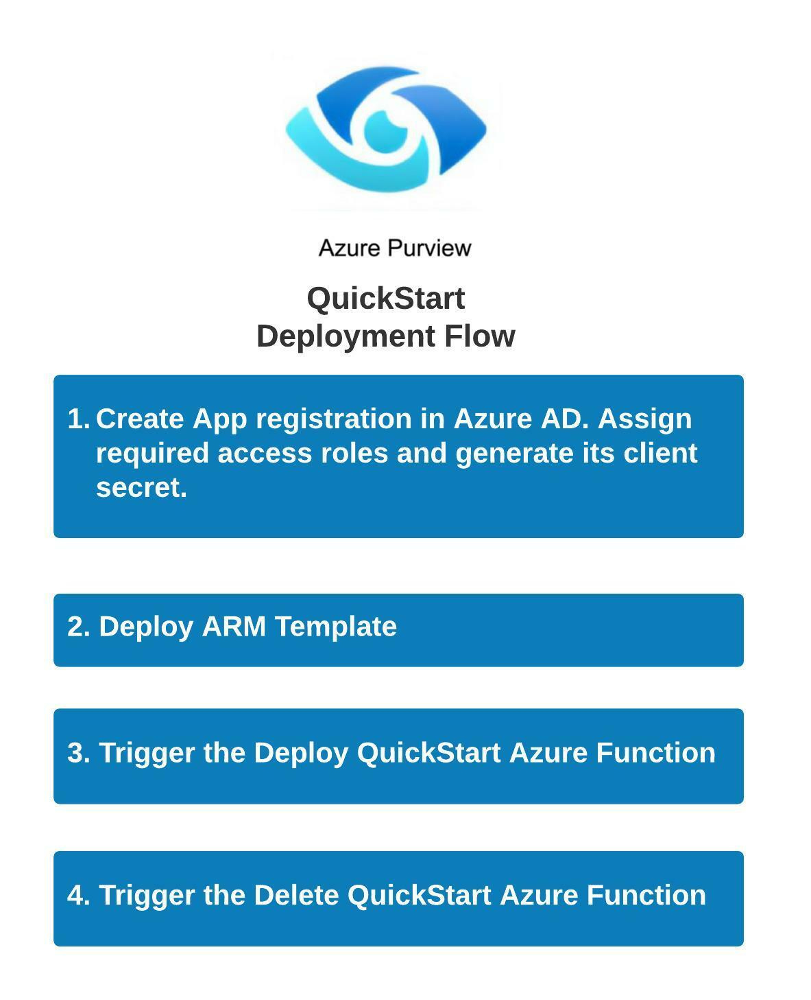

# purview-poc

  

Azure Purview accounts are managed and configured using Azure ARM templates and Azure Functions, using Azure Purview REST APIs.

## Requirements

The following steps are required for a successful implementation of the flows:

* Create an Applicatin Registration in Azure Active Directory. Which helps in establishing a trust relationship between application and the Microsoft identity platform. Application (client) ID from the app registration is required afterwards.
* In Azure Purview account, click on `Access Control (IAM)`, add role `Purview Data Source Administrator` and `Purview Data Curator` to the Service Principal App registration creater earlier.
* Client secret can be created from `Certificates & Secrets` option under `Manage` in application registration. Click on `New client secret` button in the Client Secrets section and copy the secret under `value` column. Store this in Azure Key Vault.
* To give application access to the subscription, in the Azure Subscription console, add a role assignment of role `Contributor` to the Service Principal App registration created earlier.

## APIs

Azure Purview account configurations are managed using its REST APIs through the use of two Azure Functions. One is used to create/configure data resources' and the other to delete the provisioned resources.

The following APIs are called in the creation/configuration function:

* [Create/Update Data Source](https://docs.microsoft.com/en-us/rest/api/purview/scanningdataplane/data-sources/create-or-update)
* [Create Scan](https://docs.microsoft.com/en-us/rest/api/purview/scanningdataplane/scans/create-or-update)
* [Run Scan](https://docs.microsoft.com/en-us/rest/api/purview/scanningdataplane/scan-result/run-scan)
* [Create Glossary Term](https://atlas.apache.org/api/v2/resource_GlossaryREST.html#resource_GlossaryREST_createGlossaryTerm_POST)

The following APIs are called in the deletion function:

* [Delete Data Source](https://docs.microsoft.com/en-us/rest/api/purview/scanningdataplane/data-sources/delete)
* [Delete Glossary Term](https://atlas.apache.org/api/v2/resource_GlossaryREST.html#resource_GlossaryREST_deleteGlossaryTerm_DELETE)

## OneClick Deployment

